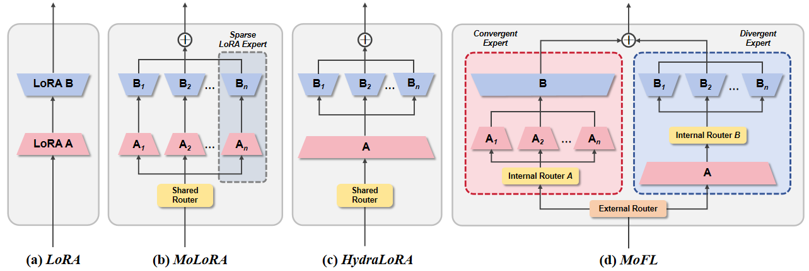

<<<<<<< HEAD
# MoFL Training & Evaluation



## Overview
This repository contains code for paper "MoFL: Fine-tuning LLMs with Mixture of Fused LoRA Experts". The project is structured to allow flexible experimentation with different configurations.


## Setup

### 1. Install Dependencies
Install required Python packages using `pip`:

```bash
pip install -r requirements.txt
```
### 2. Model Fine-tuning
Run the training script train_model.sh.

Note: Before executing, open the script and adjust the paths for your dataset and model.

```bash
bash train_model.sh
```
### 3. Model Evaluation
After training, run the evaluation script eval_model.sh to test the model.

Again, check the script for any custom paths (dataset, model checkpoint, custom tags) and update them accordingly.

```bash
bash eval_model.sh
```


## Notes
The scripts assume a certain directory structure; verify paths before execution.
=======
# MoFL Training & Evaluation


## Overview
This repository contains code for paper "MoFL: Fine-tuning LLMs with Mixture of Fused LoRA Experts". The project is structured to allow flexible experimentation with different configurations.


## Setup

### 1. Install Dependencies
Install required Python packages using `pip`:

```bash
pip install -r requirements.txt
```
### 2. Model Fine-tuning
Run the training script train_model.sh.

Note: Before executing, open the script and adjust the paths for your dataset and model.

```bash
bash train_model.sh
```
### 3. Model Evaluation
After training, run the evaluation script eval_model.sh to test the model.

Again, check the script for any custom paths (dataset, model checkpoint, custom tags) and update them accordingly.

```bash
bash eval_model.sh
```


## Notes
The scripts assume a certain directory structure; verify paths before execution.
>>>>>>> origin/main
